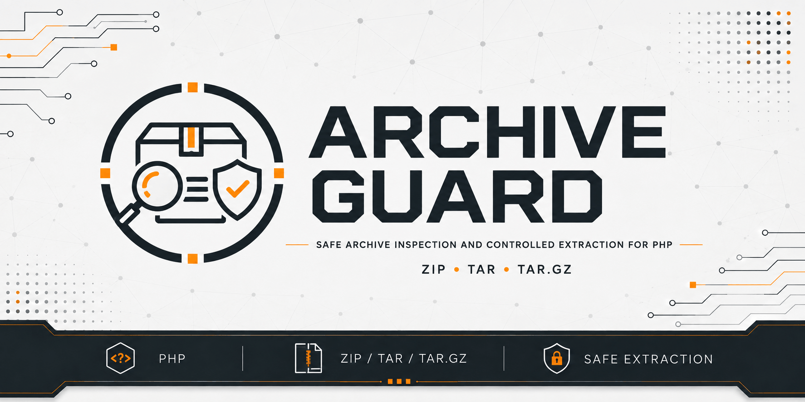

# Archive Guard

[](https://github.com/yaleksandr89/archive-guard)
[](https://github.com/yaleksandr89/archive-guard/actions/workflows/ci.yml)
[](https://www.php.net/)
[](../../LICENSE)



## Elige un idioma

| Русский | English | Español | 中文 | Français | Deutsch |
|---|---|---|---|---|---|
| [Русский](../../README.md) | [English](./README_en.md) | **Seleccionado** | [中文](./README_zh.md) | [Français](./README_fr.md) | [Deutsch](./README_de.md) |

Archive Guard es una biblioteca PHP para comprobar archivos ZIP, TAR y TAR.GZ antes de
descomprimirlos y extraer archivos con límites definidos de antemano.

## Para qué sirve el paquete

Si una aplicación recibe un archivo ZIP, TAR o TAR.GZ de un usuario o de un servicio externo,
conviene comprobar antes de descomprimir que no contiene rutas peligrosas, enlaces ni
elementos no compatibles, y que su tamaño y el volumen de datos descomprimidos se mantienen
dentro de los límites permitidos por la aplicación.

El paquete permite comprobar un archivo por separado antes de descomprimirlo o comprobarlo y
extraer su contenido en una sola operación. Si no supera la comprobación, la aplicación
recibe una causa concreta.

## Qué hace el paquete

- detecta el formato por el contenido del archivo, no por la extensión del nombre;
- comprueba las rutas internas y evita que salgan del directorio de destino;
- rechaza enlaces simbólicos, enlaces duros, objetos especiales y elementos no compatibles;
- limita el tamaño máximo del archivo, la cantidad de archivos y carpetas que
  contiene y el volumen total de datos tras la descompresión;
- devuelve una lista estructurada de infracciones que la aplicación puede procesar;
- permite comprobar un archivo con `inspect()` o comprobarlo y extraerlo con `extract()`;
- en Windows, además comprueba nombres que el sistema de archivos no puede crear de forma
  segura.

Las diferencias detalladas entre ZIP, TAR y TAR.GZ se describen en la
[referencia de archivos compatibles](../reference/supported-archives_es.md).

## Requisitos

- PHP `^8.4`;
- `ext-zip`;
- `ext-zlib`.

## Inicio rápido

### Comprobar un archivo

[`ArchiveGuard::inspect()`](../../src/ArchiveGuard.php) comprueba el archivo sin extraer nada.
Los límites se configuran mediante [`ArchivePolicy`](../../src/ArchivePolicy.php).

<details>
<summary>Mostrar ejemplo de comprobación</summary>

```php
<?php

use Yaleksandr\ArchiveGuard\ArchiveGuard;
use Yaleksandr\ArchiveGuard\ArchivePolicy;

$archivePath = '/path/to/archive.zip';

// Elige límites acordes con los archivos reales y los recursos de tu aplicación.
$policy = new ArchivePolicy(
    maxArchiveBytes: 50_000_000,
    maxEntries: 1_000,
    maxEntryUncompressedBytes: 10_000_000,
    maxTotalUncompressedBytes: 100_000_000,
);

$inspection = new ArchiveGuard()->inspect($archivePath, $policy);

if ($inspection->isAccepted()) {
    echo 'El archivo superó la comprobación.' . PHP_EOL;
} else {
    foreach ($inspection->violations() as $violation) {
        // code identifica la causa del rechazo; message contiene su descripción textual.
        echo $violation->code->value . ': ' . $violation->message . PHP_EOL;
    }
}
```

</details>

Los valores anteriores son solo de ejemplo. Debes elegirlos según el tamaño de los archivos
que realmente espera tu aplicación. El flujo de comprobación se explica con más detalle en la
[guía de `inspect()`](../guides/inspection_es.md).

### Extraer archivos

[`ArchiveGuard::extract()`](../../src/ArchiveGuard.php) realiza la comprobación obligatoria
inmediatamente antes de escribir archivos. La aplicación crea previamente el directorio de
destino.

<details>
<summary>Mostrar ejemplo de extracción</summary>

```php
<?php

use Yaleksandr\ArchiveGuard\ArchiveGuard;
use Yaleksandr\ArchiveGuard\ArchivePolicy;

$archivePath = '/path/to/archive.zip';
$destinationPath = '/path/to/empty-directory';

// Elige límites acordes con los archivos reales y los recursos de tu aplicación.
$policy = new ArchivePolicy(
    maxArchiveBytes: 50_000_000,
    maxEntries: 1_000,
    maxEntryUncompressedBytes: 10_000_000,
    maxTotalUncompressedBytes: 100_000_000,
);

$result = new ArchiveGuard()->extract($archivePath, $destinationPath, $policy);

echo 'Archivos: ' . $result->filesExtracted() . PHP_EOL;
echo 'Directorios: ' . $result->directoriesCreated() . PHP_EOL;
echo 'Bytes escritos: ' . $result->bytesWritten() . PHP_EOL;
```

</details>

El resultado de una llamada anterior a `inspect()` no se usa como permiso para escribir:
`extract()` comprueba el estado actual del archivo justo antes de la extracción. Los requisitos
del destino y el comportamiento ante errores se describen en la
[guía de extracción](../guides/extraction_es.md).

## Política de comprobación

[`ArchivePolicy`](../../src/ArchivePolicy.php) define límites superiores a partir de los
cuales se rechaza el archivo:

- tamaño máximo del archivo;
- cantidad máxima de archivos y carpetas en su interior; en TAR, algunos elementos de
  metadatos del formato también cuentan dentro de este límite;
- tamaño máximo de un solo archivo tras la descompresión;
- tamaño máximo total de todos los datos descomprimidos;
- límite opcional de la relación entre tamaño descomprimido y tamaño comprimido.

No existen valores universales: un archivo aceptable para subir avatares y una copia de
seguridad aceptable necesitarán límites distintos. Todos los parámetros y sus reglas se
describen en la [referencia de la política](../reference/policy-and-errors_es.md).

## Infracciones y errores

Si el formato se reconoce pero el archivo no supera las comprobaciones configuradas,
[`inspect()`](../../src/ArchiveGuard.php) devuelve un
[`InspectionResult`](../../src/InspectionResult.php) con las infracciones.

Las excepciones se usan para otros tipos de fallo:

- [`ArchiveOpenException`](../../src/Exception/ArchiveOpenException.php) — no se puede abrir
  el archivo, no se reconoce el formato o la estructura está dañada;
- [`ArchiveRejectedException`](../../src/Exception/ArchiveRejectedException.php) — el archivo
  no superó la comprobación obligatoria antes de extraer y no se inició la escritura;
- [`ExtractionException`](../../src/Exception/ExtractionException.php) — el problema está
  relacionado con el directorio de destino o apareció durante la extracción.

<details>
<summary>Mostrar ejemplo de gestión de errores</summary>

```php
<?php

use Yaleksandr\ArchiveGuard\ArchiveGuard;
use Yaleksandr\ArchiveGuard\Exception\ArchiveOpenException;
use Yaleksandr\ArchiveGuard\Exception\ArchiveRejectedException;
use Yaleksandr\ArchiveGuard\Exception\ExtractionException;
use Yaleksandr\ArchiveGuard\ArchivePolicy;

$archivePath = '/path/to/archive.zip';
$destinationPath = '/path/to/empty-directory';

$policy = new ArchivePolicy(
    maxArchiveBytes: 50_000_000,
    maxEntries: 1_000,
    maxEntryUncompressedBytes: 10_000_000,
    maxTotalUncompressedBytes: 100_000_000,
);

$guard = new ArchiveGuard();

try {
    $result = $guard->extract($archivePath, $destinationPath, $policy);
} catch (ArchiveRejectedException $e) {
    // El archivo se leyó, pero no superó las comprobaciones configuradas.
    foreach ($e->inspectionResult()->violations() as $violation) {
        echo $violation->code->value . PHP_EOL;
    }
} catch (ArchiveOpenException $e) {
    // El archivo no se puede abrir o su estructura no es válida.
    echo $e->getMessage() . PHP_EOL;
} catch (ExtractionException $e) {
    // El archivo superó la comprobación, pero no se pudo completar la extracción.
    echo $e->getMessage() . PHP_EOL;
}
```

</details>

La lista completa de códigos de infracción y excepciones está disponible en la
[referencia de errores](../reference/policy-and-errors_es.md).

## Seguridad y limitaciones

Durante la extracción hay varias condiciones importantes:

- **Cada extracción necesita un directorio vacío independiente.** Si la aplicación usa una
  carpeta común para todos los archivos, crea un subdirectorio nuevo para cada operación.
  La versión actual no descomprime sobre archivos ya existentes.
- **No se sustituye un archivo o directorio existente.** Si durante la extracción aparece
  un objeto en la ruta necesaria, la operación falla en lugar de sobrescribirlo.
- **No se restauran permisos, propietario ni fecha de modificación almacenados en el archivo.**
  Se extraen el contenido de los archivos y la estructura de directorios; no se aplican los
  metadatos guardados en el archivo.
- **Windows tiene restricciones adicionales para los nombres.** Por ejemplo, Windows no
  permite `CON`, `NUL`, nombres que terminan en punto ni algunos nombres con caracteres
  especiales. Por eso un archivo puede superar la comprobación general y ser rechazado
  justo antes de la extracción en Windows.
- **La extracción no es atómica.** Si se agota el espacio en disco o se produce otro error
  de entrada/salida, algunos archivos pueden haber quedado ya en el directorio de destino.
  Actualmente no existe una reversión automática.
- **El directorio de destino no se bloquea frente a otros procesos.** Las comprobaciones no
  cubren el caso en que otro proceso modifica el contenido del destino al mismo tiempo.
  Usa un directorio independiente al que solo tenga acceso tu aplicación durante la operación.

Las razones de estos límites y las responsabilidades que siguen siendo de la aplicación se
describen en el [modelo de seguridad](../security-model_es.md).

## Comentarios y ayuda

- errores reproducibles — [GitHub Issues](https://github.com/yaleksandr89/archive-guard/issues);
- preguntas de uso e ideas — [GitHub Discussions](https://github.com/yaleksandr89/archive-guard/discussions).

---

<p align="center">
  Si el paquete te resultó útil, dale una estrella en GitHub para que otros desarrolladores puedan encontrarlo más fácilmente. 🤘
</p>
